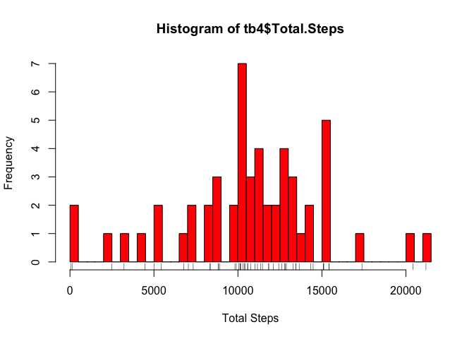
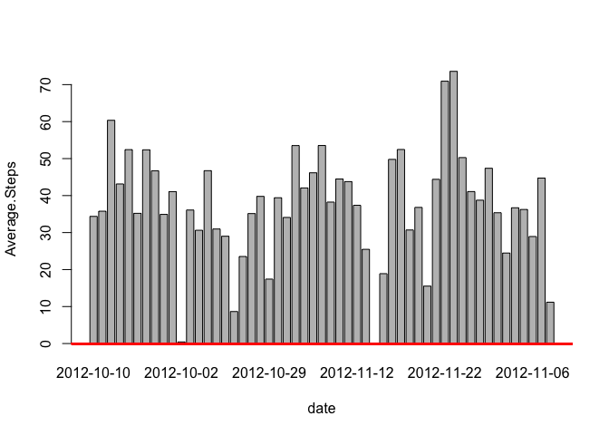
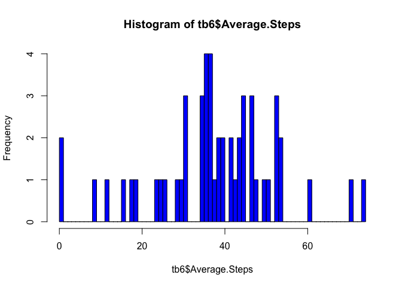
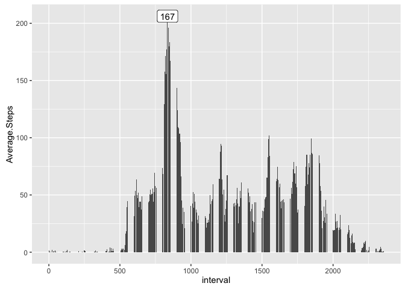
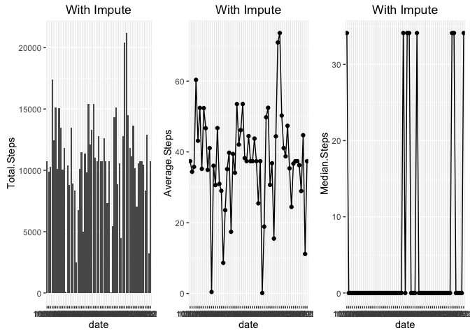
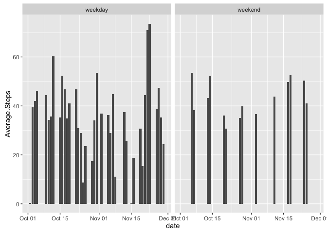

# temp

This is an R Markdown document. Markdown is a simple formatting syntax for authoring HTML, PDF, and MS Word documents. For more details on using R Markdown see <http://rmarkdown.rstudio.com>.

When you click the **Knit** button a document will be generated that includes both content as well as the output of any embedded R code chunks within the document. You can embed an R code chunk like this:

## source gridExtra to plot graphs on different panels with ggplot
## source all relevant libraries

```r
library(gridExtra)
```

```
## Warning: package 'gridExtra' was built under R version 3.2.4
```

```r
library(utils)
library(stats)
library(methods)
library(grDevices)
library(graphics)
library(ggplot2)
```

```
## Warning: package 'ggplot2' was built under R version 3.2.4
```

```r
library(dplyr)
```

```
## 
## Attaching package: 'dplyr'
```

```
## The following object is masked from 'package:gridExtra':
## 
##     combine
```

```
## The following objects are masked from 'package:stats':
## 
##     filter, lag
```

```
## The following objects are masked from 'package:base':
## 
##     intersect, setdiff, setequal, union
```
### Loading and preprocessing the data
## Read the CSV file for pre-processing - Local directory is hardcoded.

```r
tb1<-read.csv("~/Desktop/Coursera/Data\ science/data/activity.csv",header=TRUE)
```
## filter all tables with all rows having NA using dplyr package.

```r
tb2<-filter(tb1,!is.na(steps))
tb2_impute<-filter(tb1,is.na(steps))
```
## Q1) What is mean total number of steps taken per day?

## Total Steps grouped by date (THIS IS A BAR PLOT FOR MY ANALYSIS)
## For this example i felt BAR plots are more useful and i am plotting
## histogram as well


```r
tb3<-tb2 %>%
    group_by(date) %>%
    summarize(Total.Steps = sum(steps)) %>%
    arrange(date)
tb4<-mutate(tb3,date=as.Date(date,"%m/%d/%y"))
date_tb<-table(tb4$date)
```
## plot the timeseris for Total steps.

```r
barplot(tb4$Total.Steps,
        date_tb,names.arg=tb4$date,xlab="date",ylab="Steps")
```


```r
dev.print(png,"plot49.png")
```

```
## Warning in dev.print(png, "plot49.png"): need to specify one of 'width' and
## 'height'
```

```
## quartz_off_screen 
##                 2
```

```r
dev.off()
```

```
## null device 
##           1
```
## Plot the histogram as well as asked.

```r
hist(tb4$Total.Steps,col="Red",breaks=70,xlab="Total Steps")
rug(tb4$Total.Steps)
```


## print the plot.

```r
dev.print(png,"plot50.png")
```

```
## Warning in dev.print(png, "plot50.png"): need to specify one of 'width' and
## 'height'
```

```
## quartz_off_screen 
##                 2
```

```r
dev.off()
```

```
## null device 
##           1
```

## Mean and Median of steps (BAR PLOT FOR MY ANALYSIS)

```r
tb5<-tb2 %>%
    group_by(date) %>%
    summarize(Average.Steps=mean(steps),Median.Steps = median(steps)) %>%
    arrange(date)


tb6<-mutate(tb5,date=as.Date(date,"%m/%d/%y"))
date_tb<-table(tb6$date)
barplot(tb6$Average.Steps,
        date_tb,names.arg=tb6$date,xlab="date",ylab="Average.Steps")
abline(h=tb5$Median.Steps,lwd=2,col="Red")
```



```r
## Reporting MEAN and MEDIAN each day.
## From the barplot Maximum mean is 70 steps around 11/22 and minimum is 0
## Median for each day is 0
```
## print the plot

```r
hist(tb6$Average.Steps,col="Blue",breaks= 70)
```



```r
dev.print(png,"plot51.png")
```

```
## Warning in dev.print(png, "plot51.png"): need to specify one of 'width' and
## 'height'
```

```
## quartz_off_screen 
##                 2
```

```r
dev.off()
```

```
## null device 
##           1
```


```r
hist(tb6$Median.Steps,col="Green",breaks =70)
```


```r
dev.print(png,"plot52.png")
```

```
## Warning in dev.print(png, "plot52.png"): need to specify one of 'width' and
## 'height'
```

```
## quartz_off_screen 
##                 2
```

```r
dev.off()
```

```
## null device 
##           1
```
## complete data

```r
tb6
```

```
## Source: local data frame [53 x 3]
## 
##          date Average.Steps Median.Steps
##        (date)         (dbl)        (dbl)
## 1  2012-10-10      34.37500            0
## 2  2012-10-11      35.77778            0
## 3  2012-10-12      60.35417            0
## 4  2012-10-13      43.14583            0
## 5  2012-10-14      52.42361            0
## 6  2012-10-15      35.20486            0
## 7  2012-10-16      52.37500            0
## 8  2012-10-17      46.70833            0
## 9  2012-10-18      34.91667            0
## 10 2012-10-19      41.07292            0
## ..        ...           ...          ...
```

###What is the average daily activity pattern?
## Here is an attempt to plot time series plot across all days for each
## 5 min interval. As seen in graph 167th 5min interval = 5*167 = 835th 5 min
## interval has maximum average across all days.
## idea is to use dplyr package to group by interval across all days 
## take the average. Use the ggplot package to plot the graph between
## each 5 minute interval and average number of steps across all days.


```r
tb2_time<-tb2 %>%
    group_by(interval) %>%
    summarize(Average.Steps=mean(steps)) %>%
    arrange()
max_tb2_time<-tb2_time[which(
    tb2_time$Average.Steps ==max(tb2_time$Average.Steps)),]
g1<-ggplot(tb2_time,aes(x=interval,y=Average.Steps))
g2<-g1 +geom_bar(stat = "identity")
g3<- g2 + geom_point(data=max_tb2_time,size=4,alpha=1/2) +
    geom_label(data=max_tb2_time,aes(label=max_tb2_time$interval/5))

g3
```




```r
dev.print(png,"plot53.png")
```

```
## Warning in dev.print(png, "plot53.png"): need to specify one of 'width' and
## 'height'
```

```
## quartz_off_screen 
##                 2
```

```r
dev.off()
```

```
## null device 
##           1
```

## Imputing Missing values
## Logic to Impute now : Calculate the Average for that 5mins slot
## insert the average for every NA entry.


```r
impute_rows<-nrow(tb2_impute)

for(j in 1:nrow(tb2_time)) {
        for( i in 1:nrow(tb2_impute)) {
           if (tb2_impute[i,3] == tb2_time[j,1]) {
                tb2_impute[i,1]<-tb2_time[j,2]
           }
        }
    }

tb2_no_impute<-filter(tb1,!is.na(steps))
tb2_final_impute<-rbind(tb2_no_impute,tb2_impute)

tb2_imp<-tb2_final_impute %>%
    group_by(date) %>%
    summarize(Total.Steps = sum(steps)) %>%
    arrange(date)

tb5_imp<-tb2_final_impute %>%
    group_by(date) %>%
    summarize(Average.Steps=mean(steps),Median.Steps = median(steps)) %>%
    arrange()

tb4_imp<-mutate(tb2_imp,date=as.Date(date,"%m/%d/%y"))
date_tb<-table(tb4_imp$date)
barplot(tb4_imp$Total.Steps,
        date_tb,names.arg=tb4_imp$date,xlab="date",ylab="Steps")
```


## Again Bar plot is only for "MY ANALYSIS" : Felt barplot is
## better than Histogram

```r
dev.print(png,"plot54.png")
```

```
## Warning in dev.print(png, "plot54.png"): need to specify one of 'width' and
## 'height'
```

```
## quartz_off_screen 
##                 2
```

```r
dev.off()
```

```
## null device 
##           1
```

```r
hist(tb4_imp$Total.Steps,breaks =70,col="Blue",
     xlab= "total_steps_after_impute")
```


```r
dev.print(png,"plot55.png")
```

```
## Warning in dev.print(png, "plot55.png"): need to specify one of 'width' and
## 'height'
```

```
## quartz_off_screen 
##                 2
```

```r
dev.off()
```

```
## null device 
##           1
```

## Impute and No Impute Comparison
## This is for my analysis look like not asked.


```r
tb_imp<-full_join(tb2_imp,tb5_imp,by="date")
g10<-ggplot(tb_imp) + geom_bar(aes(x=date,y=Total.Steps),stat="identity") + 
      ggtitle("With Impute")
g11<-ggplot(tb_imp,aes(x=date,y=Average.Steps,group=1)) +
     geom_point() + geom_line() + ggtitle("With Impute")
g12<-ggplot(tb_imp,aes(x=date,y=Median.Steps,group=1)) + 
    geom_point() + geom_line() + ggtitle("With Impute")

grid.arrange(g10,g11,g12,ncol=3)
```



```r
dev.print(png,"plot56.png")
```

```
## Warning in dev.print(png, "plot56.png"): need to specify one of 'width' and
## 'height'
```

```
## quartz_off_screen 
##                 2
```

```r
dev.off()
```

```
## null device 
##           1
```

```r
tb_no_imp<-full_join(tb4,tb6,by="date")
g20<-ggplot(tb_no_imp) + geom_bar(aes(x=date,y=Total.Steps),stat="identity") +
     ggtitle("No Impute")
g21<-ggplot(tb_no_imp,aes(x=date,y=Average.Steps,group=1))+
    geom_point() + geom_line() + ggtitle("No Impute")
g22<-ggplot(tb_no_imp,aes(x=date,y=Median.Steps,group=1)) + 
    geom_point() + geom_line() + ggtitle("No Impute")

grid.arrange(g10,g11,g12,g20,g21,g22,ncol=3,nrow=2)
```


```r
dev.print(png,"plot57.png")
```

```
## Warning in dev.print(png, "plot57.png"): need to specify one of 'width' and
## 'height'
```

```
## quartz_off_screen 
##                 2
```

```r
dev.off()
```

```
## null device 
##           1
```
## Weekday and Weekend Average steps comparison
## Here is a panel plot to compare weekend and weekday Average number
## of steps. I got a feedback that this is not panel. But i think it is
## if it is not let me know why/why not.


```r
tb6_week<-mutate(tb6,day_of_the_week = format(tb6$date,'%A'))

tb6_week<-mutate(tb6_week,factors_week=factor(tb6_week$day_of_the_week))
levels(tb6_week$factors_week)<-list(
                weekday = c("Monday","Tuesday","Wednesday",
                            "Thursday","Friday"),
                weekend = c("Saturday","Sunday"))

g51<-ggplot(tb6_week,aes(x=date,y=Average.Steps)) + 
    geom_bar(stat="identity")+facet_grid(.~factors_week)

g51
```



```r
dev.print(png,"plot58.png")
```

```
## Warning in dev.print(png, "plot58.png"): need to specify one of 'width' and
## 'height'
```

```
## quartz_off_screen 
##                 2
```

```r
dev.off()
```

```
## null device 
##           1
```
#```{r}
#summary(cars)
#```

You can also embed plots, for example:


```r
#plot(cars)
```

Note that the `echo = FALSE` parameter was added to the code chunk to prevent printing of the R code that generated the plot.
